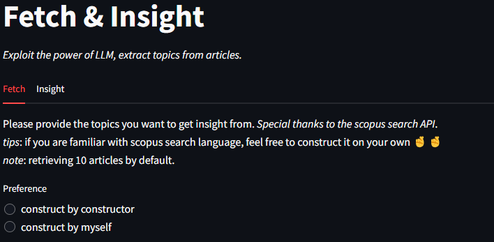
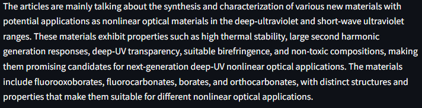

# Utilities illustration 🔧
_Sisyphus Extractor_ is a tool to extract well formated data out from chemisty/material articles by exploiting the power of large language model.

## Table of contents
[How to use](#💻-how-to-use)  
[The main utilities](#🙌-the-main-utilities)  
- [Article retrieving](#article-retrieving)


## 💻 How to use
 _Sisyphus_ provides both CLI and UI. Accordingly, you can have some customizations in CLI mode.

 ## 🙌 The main utilities
 
 ### Article retrieving
Collect DOIs from search engine (web of science of scopus), then execute  

```python
python main_crawler.py --retrieval_dois <file_contains_doi>
```

The download speed is ~4 s for an article. For 100 articles, cost ~ 4 mins.


### A niche widget
This tool provide a small widget to quick grasp some ideas of specfic fields just by giving some keywords and you will get a short but comprehensive summary of that field. Use this when you are not familiar with some research area.  
_Below are the demo version._  

  

_Here is the result._  




### Extract
The extract process is quite straight forward.
- Define a query to let this tool find the estimated location in the origin article.
- Construct some criterions to let llm model decide the candidate sentences for extracting.
- Define your data model, which ensure you get exactly what you wanted.

We'll go through this process.
