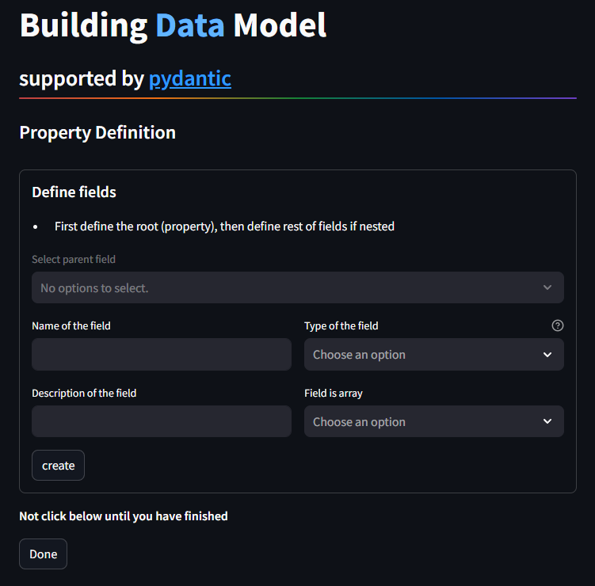

# Utilities illustration 🔧
_Sisyphus Extractor_ is a tool to extract well formated data out from chemisty/material articles by exploiting the power of large language model.

## Table of contents

## 💻 How to use
 _Sisyphus_ provides both CLI and UI. Accordingly, you can have some customizations in CLI mode.

 ## 🙌 The main utilities
 
 ### Article retrieving

example image

