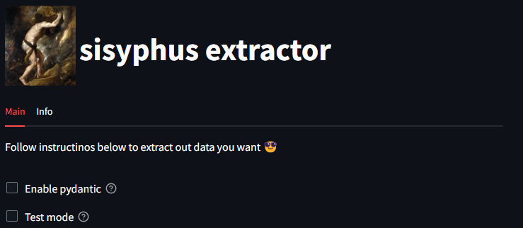
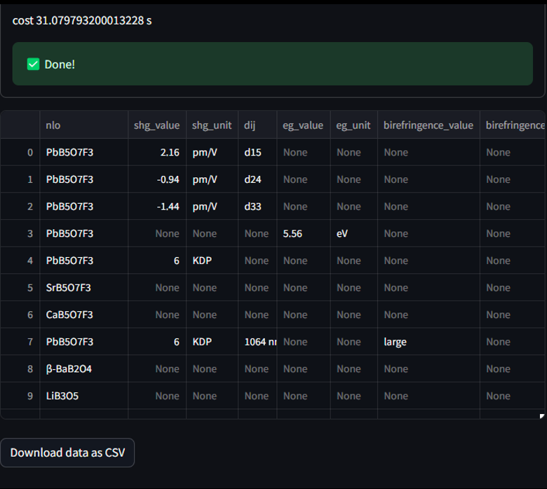

# Utilities illustration 🔧
_Sisyphus Extractor_ is a tool to extract well formated data out from chemisty/material articles by exploiting the power of large language model.  


## Table of contents
[How to use](#💻-how-to-use)  
[The main utilities](#🙌-the-main-utilities)  
- [Article retrieving](#article-retrieving)
- [Extract](#extract)
  - [Query define](#query-define)
  - [Criteria define](#criteria-define)
  - [Model define](#model-define)
  - [extract](#extract-1)


## 💻 How to use
 _Sisyphus_ provides both CLI and UI. Accordingly, you may have some customizations in CLI mode.

 ## 🙌 The main utilities
 
 ### Article retrieving
Collect DOIs from search engine (web of science or scopus), then execute  

```python
python main_crawler.py --retrieval_dois <file_contains_doi>
```

The download speed is ~4 s for an article. For 100 articles, cost ~ 4 mins.


### A niche widget
This tool provide a small widget to quick grasp some ideas of specfic fields just by giving some keywords and you will get a short but comprehensive summary of that field. Use this when you are not familiar with some research area.  
_Below is the demo._  

  

_Here is the result._  


### Extract
The extract process is quite straight forward.
- Define a query to let this tool find the estimated location in the origin article.
- Construct some criterions to let llm model decide the candidate sentences for extracting.
- Define your data model, which ensure you get exactly what you wanted.

Case review. __nonlinear optical material key properties extraction.__  

#### _Query define_  
just write a middle size sentence aroud 200 words.
> Description of the properties of NLO materials, include the name of nlo material (e.g. KBBF, Na4B8O9F10), second harmonic generation SHG (e.g. 0.8 pm/V, 3 × KDP), band gaps Eg (e.g. 6.2 eV), birefringence, phase match, absorption edge, laser induced damage thersholds (LIDT). reports values unit such as (eV, pm/V, MW/cm2, nm), and the SHG value is sometimes given in multiples of KDP or AgGaS2

> Note: You are supposed to include all the properties that will be extracted in later steps.


#### _Criteria define_  
this helps llms to judge whether the setence has target information or not.
> Given a text quoted by triple backticks, judge whether the text contains the desired information. Return a JSON object with the following criteria:
    a. Check if the text includes at least one chemical compound (e.g., KBBF, BaB2O4, abbreviation, or pronoun).
    b. Verify if the text includes at least one nonlinear optical (nlo) materials property corresponding to a specific chemical compound, such as second harmonic generation coefficient (dij), band gaps (Eg), birefringence, absorption edge (cutoff edge), or LIDT.
    c. Confirm that the text contains at least one numerical value (e.g. 4.5 eV, 0.45 pm V-1) corresponding to a nonlinear optical (nlo) materials property.
    Sequentially examine each criterion. If any criterion is not met, return False for that criterion. Output a JSON complying with the schema:

    {
    "a": true/false,
    "b": true/false,
    "c": true/false
    }

#### _Model define_  
this tool supported user created pydantic model by hard coding or by UI interacting.  
below is screenshot of the UI.  
  

Some features help you to get an intuitive observation of your own model.  
  

#### _extract_
The former steps ensure that we have a solid preparation for extraction and now we are heading the the main point.  
For CLI users, just typing
```python
python main.py
```
For UI users, just click submit, and waiting.  
Result is plainly jsonl file, so for illustration purpose, converted to csv to have a intuitive feeling. Note that this is the raw data, so no filtering is executed. For 100 papers extraction, the runnning time is around 8 min.


